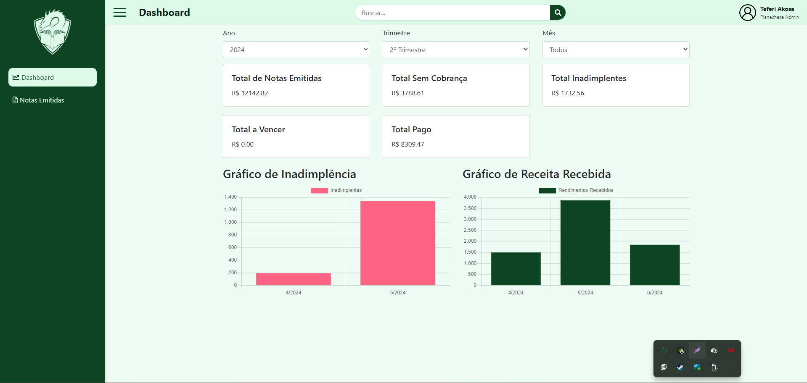
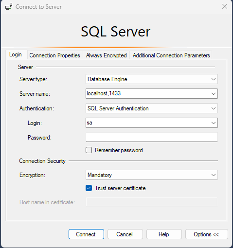

# Tolarian Shop Dashboard
[](/)

## Desenvolvedor
**Mateus Vieira Mourão**
[GitHub](https://github.com/mathieux-dev) | [LinkedIn](https://www.linkedin.com/in/mateus-mourao/) | [Portfólio](https://mathieux-dev.github.io/)

## Descrição do Projeto
Tolarian Shop Dashboard é um sistema para gerenciar notas fiscais, exibindo informações detalhadas de cada transação.

## Tecnologias Utilizadas
- **ASP.NET Core**: 8.0
- **SQL Server**: 2022
- **Docker**: Latest
- **Entity Framework Core**: 8.0

## Instruções de Setup

### Passo 1: Clonar o Repositório
Baixe o projeto em sua máquina local executando o seguinte comando:

```bash
git clone https://github.com/seu-repositorio/tolarian-shop-dashboard.git
cd tolarian-shop-dashboard
```

### Passo 2: Baixar, Configurar e Executar o Docker
Depois de baixar o docker, o execute e na raiz do projeto, execute o Docker Compose para construir e executar os contêineres:

```bash
docker-compose up --build -d
```

Isso iniciará os contêineres da aplicação e do banco de dados.

### Passo 3: Conectar ao Servidor SQL
Conecte-se ao servidor SQL (aqui serão adicionados os prints):

- Use o **SQL Server Management Studio (SSMS)**.
- Host: `localhost`
- Porta: `1433`
- **Login**: `sa`
- **Senha**: `P@ssw0rd2024!`

[](/)

### Passo 4: Executar o Script do Banco de Dados
Após conectar-se ao SQL Server, execute o script SQL localizado em `/scripts/script.sql` para criar e popular o banco de dados.
Copie o conteúdo do `script.sql` em uma nova consulta e a execute.

### Passo 5: Acessar o Sistema
Depois que o sistema estiver rodando, acesse o painel através do seguinte link:

```
http://localhost:5000
```
